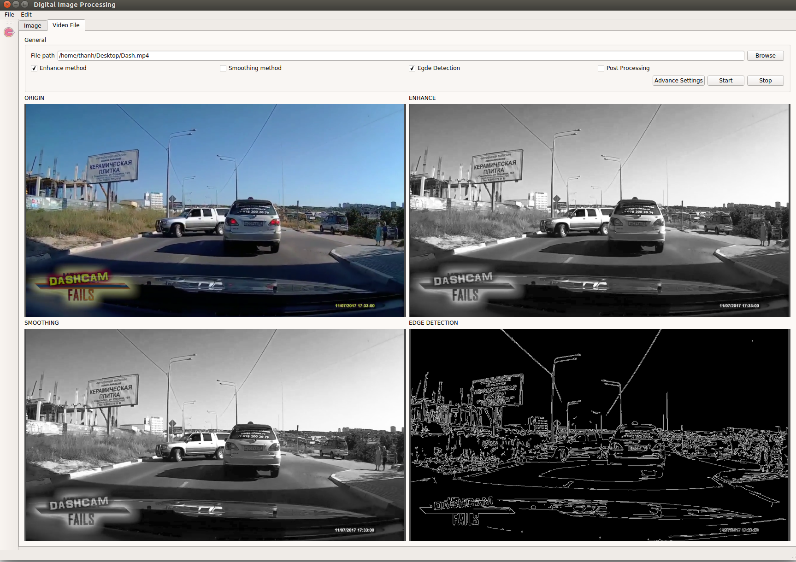

# Edge detection with openCV [](https://travis-ci.org/xuanthanhbk92/QtOpenCv) [](https://badge.fury.io/gh/xuanthanhbk92%2FQtOpenCv)

Use openCV to process edge detection on image and video


#### Operating system:
- linux (Ubuntu 16.04) - Supported 
- window - Planed 

#### How to build 

##### Require:
- build essensial tool
- Qt5
- opencv2
##### Build
Go to project folder and do command 

```
$mkdir build && cd build 
$qmake ..
$make
$./OpenCV  #run  program

```
#### Reference 

You can prefer this process if you cannot build by yourseft

##### Build reference on travis 
```
before_install:
 - sudo add-apt-repository --yes ppa:beineri/opt-qt551-trusty
 - sudo apt-get update -qq
install:
 - sudo apt-get install libopencv-dev
 - sudo apt-get -y install qt55[QTPACKAGE]

script:
 - source /opt/qt55/bin/qt55-env.sh
 - /opt/qt55/bin/qmake -v
 - /opt/qt55/bin/qmake
 - make
```
